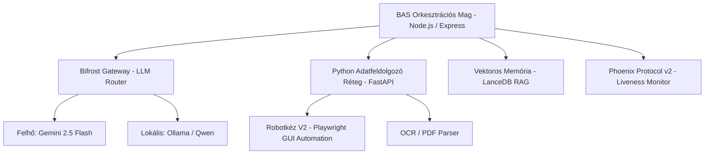

# Fejlesztési és Kivitelezési Terv – BAS + DIMOP + Széchenyi

Ez a dokumentum a Pohánka és Társa Kft. digitalizációs és folyamat-automatizációs projektjének átfogó fejlesztési és kivitelezési terve. A terv magában foglalja a **Brunella Agent System (BAS)** fejlesztését, a **DIMOP Plusz-1.2.6/B-26** pályázatban foglalt szoftveres és képzési elemeket, valamint a **Széchenyi Mikrohitel MAX+** hitelcsomagból finanszírozott hardveres és mobilitási infrastruktúra megvalósítását.

---

## 1. Projektösszefoglaló

A projekt célja a Pohánka és Társa Kft. könyvelési, számviteli és adminisztratív munkafolyamatainak radikális digitalizálása és automatizálása. A manuális adatrögzítést egy intelligens, mesterséges intelligenciára épülő ügynökrendszer (BAS) váltja fel.

### Fő üzleti és operatív célok:
*   **Kapacitásbővítés létszámnövelés nélkül:** A 3 fős munkatársi létszám megtartása mellett a cég képessé válik 30-50%-kal több könyvelési ügyfél kiszolgálására.
*   **Adminisztratív időmegtakarítás:** A manuális adatrögzítéssel és egyeztetésekkel töltött idő legalább **50%-os csökkentése**.
*   **Automatikus számlafeldolgozás:** A beérkező bizonylatok legalább **80%-ának** emberi beavatkozás nélküli feldolgozása (letöltés, OCR, AI-alapú adatkinyerés).
*   **Automatizált banki egyeztetés:** A bankkivonatok és pénztárbizonylatok legalább **70%-os** automatikus párosítása a megfelelő számlákhoz.
*   **Megbízhatóság és biztonság:** 24/7-ben működő öngyógyító architektúra a bizalmas pénzügyi adatok helyi (on-premise) védelme mellett.

---

## 2. Modulok és komponensek

A Brunella Agent System (BAS) egy kétrétegű, modern, hibrid architektúrára épül:



### 2.1. BAS Orkesztrációs Mag (Node.js/Express/Socket.IO)
A rendszer központi vezérlőegysége, amely koordinálja a feladatokat, kezeli az üzenetsorokat (job queues) és valós idejű kommunikációs csatornát biztosít a komponensek között. Itt fut a Phoenix Protocol v2 liveness monitoringja is.

### 2.2. Python Adatfeldolgozó Réteg (FastAPI/Pandas/Playwright)
A nehéz adatfeldolgozásért és a szoftver-automatizálásért felelős réteg. A Vision-Language-Action (VLA) képességekkel ellátott **Robotkéz V2** modul Playwright segítségével közvetlenül a grafikus felhasználói felületeken (cégkapu, számlázóportálok, banki webes felületek) képes interakcióba lépni a rendszerekkel.

### 2.3. Vektoros Memória és RAG (LanceDB)
Helyi vektoradatbázis, amely a korábbi könyvelési döntéseket, számlapárosításokat és partnertörzseket tárolja. Az új bizonylatok érkezésekor a Retrieval-Augmented Generation (RAG) segítségével a rendszer javaslatot tesz a könyvelési tételekre a múltbeli sikeres minták alapján.

### 2.4. Bifrost Gateway (Hibrid LLM elérés)
Az intelligens API átjáró, amely a feladat komplexitása és adatvédelmi szintje alapján dönti el, hogy a lekérdezést helyben futó modellen (Ollama + qwen2.5-coder:7b) vagy felhőalapú API-n (Google Gemini 2.5 Flash) futtatja.

---

## 3. Fejlesztési feladatok (Task lista)

| ID | Feladat megnevezése | Rövid leírás | Becsült idő | Felelős | Státusz |
|:---:|:---|:---|:---:|:---:|:---:|
| **T1** | **BAS Core architektúra véglegesítése** | A Node.js orkesztrációs mag és a Python FastAPI réteg közötti kommunikációs protokollok leütése. | 3 hét | Lead Developer | `[ ]` |
| **T2** | **Bifrost Gateway & Ollama integráció** | A lokális Ollama futtató és a hibrid LLM routing szabályrendszerének lefejlesztése és finomhangolása. | 2 hét | AI Engineer | `[ ]` |
| **T3** | **Robotkéz V2 GUI Automation** | Playwright-alapú böngésző-automatizációs modul elkészítése a NAV Online Számla és számlázóportálok eléréséhez. | 4 hét | Lead Developer | `[ ]` |
| **T4** | **LanceDB RAG & Vektoros indexelés** | A könyvelési múltbeli adatok beolvasása, vektorizálása és a LanceDB-be való feltöltése, RAG pipeline tesztelése. | 3 hét | Data Engineer | `[ ]` |
| **T5** | **Phoenix Protocol v2 implementáció** | A 5 másodperces liveness monitoring és az automatikus konténer-újraindítási (öngyógyító) logika kifejlesztése. | 2 hét | DevOps / Infra | `[ ]` |
| **T6** | **DIMOP Helper modul** | EPTK mezők automatikus formázását és a dokumentum-ellenőrzést segítő belső CLI/Helper script elkészítése. | 1 hét | Developer | `[ ]` |
| **T7** | **Széchenyi Hitelcsomag Exportőr** | A hiteligényléshez szükséges pénzügyi és beruházási adatok PDF formátumba történő automatikus exportálását végző modul. | 1 hét | Developer | `[ ]` |
| **T8** | **Végfelhasználói tesztelés & UI** | A könyvelők számára készülő egyszerűsített irányítópult (Dashboard) és visszajelzési felület kialakítása. | 3 hét | Frontend Dev | `[ ]` |

---

## 4. Ütemezés és Milestone-ok

A fejlesztési ütemezés szorosan igazodik a pályázati és finanszírozási mérföldkövekhez:

```
[2026. július] ────────────────> [2026. augusztus-szeptember] ────────────────> [2026. október-november]
  Milestone 1:                     Milestone 2:                                   Milestone 3:
  - DIMOP beadás                   - Széchenyi Hitel igénylés                     - DFK véglegesítés
  - Széchenyi előkészítés          - Hardver beszerzés (GPU, NAS)                 - BAS MVP Tesztüzem
  - T1-T2 fejlesztés indítás       - T3-T5 modulok fejlesztése                    - T6-T8 integráció
```

*   **M1: Pályázati és Hitel Előkészítés (2026. július)**
    *   DIMOP Plusz-1.2.6/B-26 pályázati anyag véglegesítése és benyújtása az EPTK-n.
    *   KAVOSZ hiteligénylési dokumentáció benyújtása.
    *   *Határidő:* 2026. július 31.
*   **M2: Infrastruktúra és Core Fejlesztés (2026. augusztus – szeptember)**
    *   A Széchenyi hitel folyósítása után a GPU munkaállomás, NAS és laptopok beszerzése, fizikai telepítése.
    *   A BAS magrendszer (T1, T2, T5) telepítése a helyi GPU munkaállomásra.
    *   *Határidő:* 2026. szeptember 30.
*   **M3: Integráció és DFK Workshop (2026. október – november)**
    *   A hivatalos DFK workshop lebonyolítása a Modern Vállalkozások Programja tanácsadójával, a végleges DFK dokumentum átvétele.
    *   A Robotkéz V2 és a LanceDB RAG modulok (T3, T4, T8) integrációja és éles könyvelési adatokkal történő tesztelése.
    *   *Határidő (DFK felhasználási limit):* 2026. november 30.
*   **M4: Éles üzem és finomhangolás (2026. december – 2027. január)**
    *   A BAS teljes körű éles üzembe állítása a könyvelőirodában.
    *   Munkatársak (3 fő) gyakorlati képzése az AI rendszerek napi szintű kezelésére.

---

## 5. Infrastruktúra és eszközök

### 5.1. Fizikai Hardver (Széchenyi hitelből finanszírozva)
*   **1 db High-End GPU Munkaállomás:** Lokális modellek futtatására (NVIDIA RTX kártyával szerelt, min. 16GB VRAM, 64GB RAM).
*   **3 db Irodai PC / Laptop:** Modern kliensgépek az irodai munkavégzéshez.
*   **1 db NAS adattároló:** RAID 1/5 konfigurációval a biztonságos helyi mentésekhez.

### 5.2. Cloud Stack (DIMOP támogatással kiegészítve)
*   **AI Modellek:** Google Gemini 2.5 Flash (Bifrost Gateway-en keresztül).
*   **Adattárolás:** Helyi LanceDB vektoradatbázis + Google Cloud Storage redundáns biztonsági mentés.
*   **Verziókezelés & CI/CD:** GitHub privát repók a biztonságos kódkezeléshez.

---

## 6. Kockázatok és mitigáció

| Kockázat leírása | Valószínűség | Hatás | Mitigációs stratégia |
|:---|:---:|:---:|:---|
| **Finanszírozás csúszása (hitelbírálati idő)** | Közepes | Magas | A core szoftverfejlesztést felhős környezetben indítjuk el (Gemini 2.5 Flash), így a hardver megérkezéséig is halad a fejlesztés. |
| **Adatvédelmi incidens (pénzügyi adatok)** | Alacsony | Kritikus | A Bifrost Gateway szigorú szabályok alapján a személyes és pénzügyi adatokat tartalmazó lekérdezéseket kizárólag a helyi GPU-n futó Ollama felé irányítja. |
| **Munkatársi ellenállás az AI-val szemben** | Közepes | Közepes | Folyamatos, gyakorlatias oktatások tartása, a BAS mint segítőtárs (nem pedig helyettesítő) pozicionálása. |
| **A DFK határidő csúszása** | Alacsony | Magas | A Kérelmi Nyilatkozat azonnali visszaküldése és a tanácsadóval való heti szintű státuszkövetés a 2026. november 30-i határidő betartásához. |
